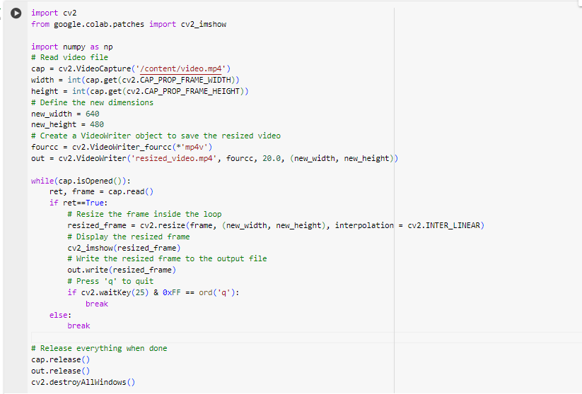

# Image_Acqusition-_using_Web_Camera
## Aim
 
Aim:
 
To write a python program using OpenCV to capture the image from the web camera and do the following image manipulations.
i) Write the frame as JPG 
ii) Display the video 
iii) Display the video by resizing the window
iv) Rotate and display the video

## Software Used
Anaconda - Python 3.7
## Algorithm
### Step 1:
Install Opencv : pip install opencv_python
### Step 2:
Specify the data or parameters required by the algorithm to operate.

### Step 3:
Algorithm Design: Break down the problem into smaller,more manageable tasks.Design the steps or procedures to solve each sub_problem.

### Step 4:
Continue the program by executing different commands.

### Step 5:
End the code

## Program:
``` Python
### Developed By: MARELLA HASINI
### Register No:212223240083

## i) Write the frame as JPG file
import cv2

cam = cv2.VideoCapture(0)
cv2.namedWindow("Python Webcam Screenshot App")
img_counter = 0
while True:
    ret,frame =  cam.read()
    if not ret:
        print("failed to grib frame")
        break
    cv2.imshow("test",frame)

    k = cv2.waitKey(1)
    if k%256 == 27:
        print("Escape hit, closing the app")
        break
    elif k%256 == 32:
        img_name = "opencv_frame_{}.jpg".format(img_counter)
        cv2.imwrite(img_name,frame)
        print("Screenshot taken")
        img_counter+=1

cam.release
cam.destroyAllwindows()

## ii) Display the video

import imageio
import matplotlib.pyplot as plt
import matplotlib.animation as animation
from skimage.transform import resize
from IPython.display import HTML

def display_video(video):
    fig = plt.figure(figsize=(3,3))  #Display size specification

    mov = []
    for i in range(len(video)):  #Append videos one by one to mov
        img = plt.imshow(video[i], animated=True)
        plt.axis('off')
        mov.append([img])

    #Animation creation
    anime = animation.ArtistAnimation(fig, mov, interval=50, repeat_delay=1000)

    plt.close()
    return anime
video = imageio.mimread('/content/video.mp4')  #Loading video
#video = [resize(frame, (256, 256))[..., :3] for frame in video]    #Size adjustment (if necessary)
HTML(display_video(video).to_html5_video())  #Inline video display in HTML5

## iii) Display the video by resizing the window

import cv2
from google.colab.patches import cv2_imshow

import numpy as np
# Read video file
cap = cv2.VideoCapture('/content/video.mp4')
width = int(cap.get(cv2.CAP_PROP_FRAME_WIDTH))
height = int(cap.get(cv2.CAP_PROP_FRAME_HEIGHT))
# Define the new dimensions
new_width = 640
new_height = 480
# Create a VideoWriter object to save the resized video
fourcc = cv2.VideoWriter_fourcc(*'mp4v')
out = cv2.VideoWriter('resized_video.mp4', fourcc, 20.0, (new_width, new_height))

while(cap.isOpened()):
    ret, frame = cap.read()
    if ret==True:
        # Resize the frame inside the loop
        resized_frame = cv2.resize(frame, (new_width, new_height), interpolation = cv2.INTER_LINEAR)
        # Display the resized frame
        cv2_imshow(resized_frame)
        # Write the resized frame to the output file
        out.write(resized_frame)
        # Press 'q' to quit
        if cv2.waitKey(25) & 0xFF == ord('q'):
            break
    else:
        break

# Release everything when done
cap.release()
out.release()
cv2.destroyAllWindows()

## iv) Rotate and display the video

import cv2
from google.colab.patches import cv2_imshow

# Load the video
video_path = '/content/video.mp4'
cap = cv2.VideoCapture(video_path)

# Check if the video opened successfully
if not cap.isOpened():
    print("Error: Could not open video file")
else:
    # Get the frame width and height
    width = int(cap.get(cv2.CAP_PROP_FRAME_WIDTH))
    height = int(cap.get(cv2.CAP_PROP_FRAME_HEIGHT))
    
    # Define the codec and create VideoWriter object
    fourcc = cv2.VideoWriter_fourcc(*'MP4V')
    out = cv2.VideoWriter('output.mp4', fourcc, 30.0, (width, height))

    # Read until video is completed
    while cap.isOpened():
        ret, frame = cap.read()
        if ret:
            # Rotate the frame (change the angle as needed)
            rotated_frame = cv2.rotate(frame, cv2.ROTATE_90_CLOCKWISE)
            
            # Display the rotated frame
            cv2_imshow(rotated_frame)
            
            # Write the rotated frame to the output video file
            out.write(rotated_frame)
            
            # Press 'q' to exit
            if cv2.waitKey(25) & 0xFF == ord('q'):
                break
        else:
            break

    # Release everything when done
    cap.release()
    out.release()
    cv2.destroyAllWindows()

```
## Output

### i) Write the frame as JPG image
.png)
.png)

### ii) Display the video
.png)

### iii) Display the video by resizing the window

.png)
.png)
.png)
### iv) Rotate and display the video
.png)
[OUTPUT](3(1).png)
-1.png)


## Result:
Thus the image is accessed from webcamera and displayed using openCV.
